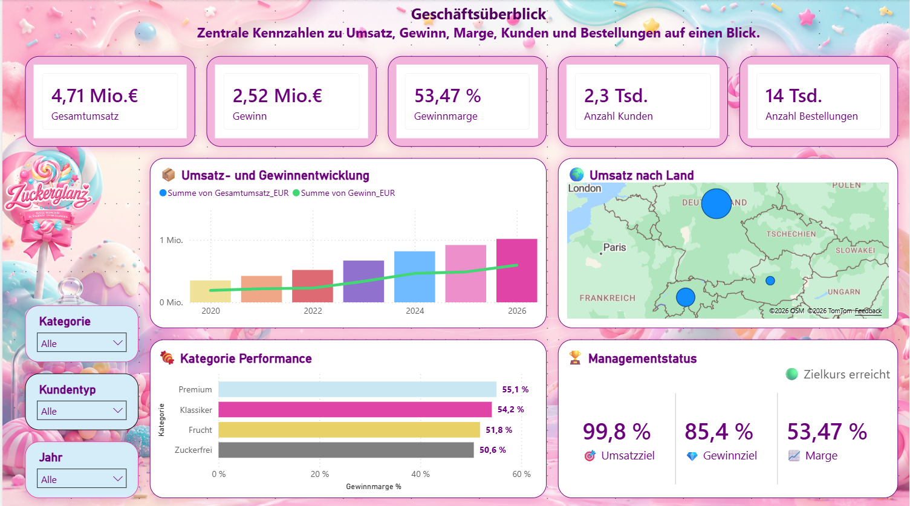

  

  <strong>Interaktives Business-Intelligence-Praxisprojekt</strong>

  Analyse von Umsatz · Gewinn · Kunden · Produkten · Qualität · Regionen

  

  

  
  
  
  

---

## 📊 Projektüberblick

Die **Zuckerglanz GmbH** ist ein fiktives Unternehmen aus der Süßwarenbranche.

Im Rahmen dieses Praxisprojekts wurde eine vollständige Business-Intelligence-Lösung mit **Microsoft Power BI** entwickelt. Die Ausgangsdaten wurden mit **Power Query** geprüft, bereinigt und transformiert. Anschließend wurden die Tabellen in einem strukturierten Datenmodell miteinander verbunden und mithilfe von **DAX-Kennzahlen** analysiert.

Ziel des Projekts war es, wirtschaftliche Entwicklungen transparent darzustellen, Optimierungspotenziale zu erkennen und konkrete Handlungsempfehlungen für das Management abzuleiten.

---

## 🌐 Interaktives Dashboard

Das vollständige Power-BI-Dashboard kann über GitHub Pages geöffnet werden:

### 👉 [Zuckerglanz Power-BI-Dashboard öffnen](https://designlili.github.io/Zuckerglanz-GmbH/)

Enthalten sind unter anderem:

- interaktive Datenschnitte
- Drilldown und Drill-through
- dynamische Tooltips
- KPI- und Zielanalysen
- Produkt- und Kundenrankings
- regionale Analysen
- Absatz- und Rabattsimulationen
- dynamische Managementempfehlungen

---

## 🎯 Projektziele

- Entwicklung eines professionellen Power-BI-Dashboards
- Bereinigung und Transformation der Ausgangsdaten
- Aufbau eines strukturierten Datenmodells
- Erstellung aussagekräftiger DAX-Kennzahlen
- Analyse von Umsatz, Kosten, Gewinn und Marge
- Bewertung von Kunden, Produkten und Regionen
- Untersuchung von Qualität und Kundenzufriedenheit
- Simulation von Absatz- und Rabattveränderungen
- Ableitung strategischer Handlungsempfehlungen

---

## 📈 Zentrale Kennzahlen

| Kennzahl | Ergebnis |
|---|---:|
| Gesamtumsatz | 4,71 Mio. € |
| Gesamtgewinn | 2,52 Mio. € |
| Gewinnmarge | 53,47 % |
| Kunden | ca. 2.300 |
| Bestellungen | ca. 14.000 |
| Durchschnittlicher Warenkorb | 341,36 € |
| Wiederkaufrate | 85,83 % |
| Durchschnittliche Bewertung | 3,8 von 5 |
| Retourenquote | 12,18 % |
| Umsatzziel erreicht | 99,8 % |
| Gewinnziel erreicht | 85,4 % |

---

## 🔍 Dashboard-Bereiche

| Nr. | Analysebereich | Schwerpunkt |
|---:|---|---|
| 01 | Geschäftsüberblick | Kennzahlen, Zielerreichung und Entwicklung |
| 02 | Finanzanalyse | Umsatz, Kosten, Gewinn und Marge |
| 03 | Kundenanalyse | Kundentypen, Kundenbindung und Wiederkauf |
| 04 | Produktanalyse | Produktleistung, Gewinn und Rankings |
| 05 | Verkauf und Bestellungen | Warenkorb, Zahlungsarten und Bestellstatus |
| 06 | Qualität und Service | Bewertungen, Retouren und Zufriedenheit |
| 07 | Markt und Regionen | Länder, Städte und regionale Verteilung |
| 08 | Profit-Simulation | Unternehmensweite Absatz- und Rabattszenarien |
| 09 | Produkt-Simulation | Simulation einzelner Bonbonsorten |
| 10 | SWOT-Analyse | Stärken, Schwächen, Chancen und Risiken |
| 11 | Maßnahmenplan | Strategische Handlungsempfehlungen |

---

## 💡 Wichtigste Erkenntnisse

- Die Gewinnmarge liegt mit **53,47 %** auf einem hohen Niveau.
- Das Umsatzziel wurde mit **99,8 %** nahezu vollständig erreicht.
- Beim Gewinnziel besteht mit **85,4 %** weiteres Potenzial.
- Firmenkunden bilden die umsatzstärkste Kundengruppe.
- Deutschland ist mit **77,85 % Umsatzanteil** der wichtigste Markt.
- Die Wiederkaufrate von **85,83 %** zeigt eine starke Kundenbindung.
- Margenstarke Produkte sollten gezielt gefördert werden.
- Bei Retouren und Kundenzufriedenheit bestehen Optimierungsmöglichkeiten.
- Rabatte sollten kontrolliert und produktspezifisch eingesetzt werden.

---

## 🧪 Simulation

Mithilfe von Was-wäre-wenn-Parametern können unterschiedliche Absatz- und Rabattszenarien untersucht werden.

| Simulationskennzahl | Ergebnis |
|---|---:|
| Simulierter Umsatz | 6,31 Mio. € |
| Simulierter Gewinn | 3,28 Mio. € |
| Möglicher Mehrgewinn | ca. 762 Tsd. € |

Die Ergebnisse ermöglichen einen direkten Vergleich zwischen dem aktuellen Stand und möglichen zukünftigen Entwicklungen.

---

## 🧩 Datenmodell

Das Datenmodell wurde nach dem Prinzip eines strukturierten Sternschemas aufgebaut.

### Verwendete Tabellen

- `_Measures`
- `Bestellungen`
- `Bestellpositionen`
- `Kunden`
- `Bonbon_Produkte`
- `Kalender`
- `Finanz Brücke`

Die Tabellen wurden über eindeutige Schlüssel miteinander verbunden. Eine separate Kalendertabelle ermöglicht konsistente zeitbezogene Analysen und den Einsatz von DAX-Zeitintelligenz.

---

## 🛠️ Verwendete Technologien

| Technologie | Verwendung |
|---|---|
| Microsoft Power BI | Dashboard und Visualisierungen |
| Power Query | Datenbereinigung und Transformation |
| DAX | Kennzahlen und Berechnungen |
| Datenmodellierung | Beziehungen und Sternschema |
| CSV | Ausgangsdaten |
| GitHub | Projektdokumentation |
| GitHub Pages | Veröffentlichung des Dashboards |
| HTML und CSS | Gestaltung der Dashboard-Webseite |

---

## ⚙️ Umgesetzte Funktionen

- Interaktive Datenschnitte
- Drilldown und Drill-through
- Dynamische Tooltips
- KPI-Karten
- Zeitintelligenz
- Zielerreichungsanalysen
- Produkt- und Kundenrankings
- Regionale Kartenvisualisierung
- Analysebaum
- Was-wäre-wenn-Parameter
- Absatz- und Rabattsimulationen
- Dynamische Managementempfehlungen
- SWOT-Analyse
- Strategischer Maßnahmenplan

---

## 🏆 Projektergebnis

Das Projekt bildet den vollständigen Ablauf eines Business-Intelligence-Projekts ab:

  <strong>
    Datenimport → Datenbereinigung → Datenmodellierung → DAX → Visualisierung → Analyse → Simulation → Handlungsempfehlungen
  </strong>

Das Dashboard unterstützt datenbasierte Entscheidungen und stellt komplexe wirtschaftliche Zusammenhänge übersichtlich und verständlich dar.

---

## ℹ️ Hinweis

Bei der **Zuckerglanz GmbH** handelt es sich um ein fiktives Praxisprojekt.

Die verwendeten Unternehmens-, Kunden-, Produkt- und Bestelldaten wurden ausschließlich zu Lern-, Analyse- und Demonstrationszwecken erstellt. Es werden keine echten personenbezogenen Kundendaten verwendet.

---

  <strong>Erstellt von Lili Kárándi</strong>

  Power BI · Power Query · DAX · Datenanalyse · Business Intelligence

  🍬 Entwickelt mit Microsoft Power BI

